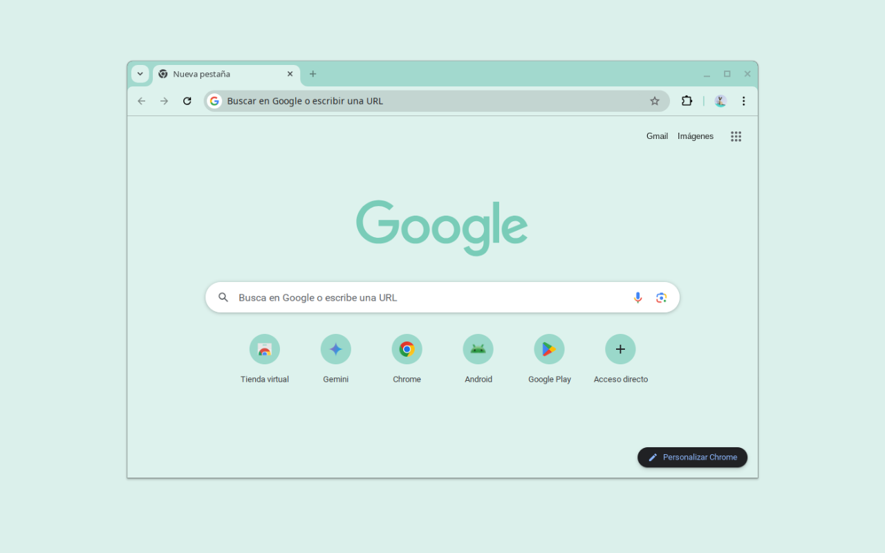

# Minimalist Turquoise 🌊

Un tema minimalista para Google Chrome con una paleta de colores inspirada en el turquesa, diseñado para una experiencia de navegación serena y elegante.

## 🎨 Características

- **Paleta de Colores**: Tonos suaves de turquoise y neutros
- **Diseño Minimalista**: Interfaz limpia y moderna
- **Fácil Instalación**: Compatible con Chrome Manifest V3
- **Personalización**: Colores armoniosos que reducen la fatiga visual

## 📦 Instalación

### Método Manual
1. Descarga el archivo `.zip` del tema
2. Abre `chrome://extensions/` en tu navegador Chrome
3. Activa el "Modo de desarrollador"
4. Haz clic en "Cargar descomprimida" y selecciona la carpeta del tema

### Método Rápido
[Tema disponible en Chrome Web Store](https://chromewebstore.google.com/detail/minimalist-turquoise/kagkhcomjcjckhhpfbakdfikimoegjoi)

## 🖌️ Personalización

El tema incluye configuraciones de color para:
- Fondo de Nueva Pestaña
- Texto
- Enlaces
- Secciones
- Botones

## 📜 Licencia

Distribuido bajo Licencia MIT. Consulta el archivo `LICENSE` para más detalles.

## 👤 Autor

**Miguel Euraque**

SEO Técnico y Desarrollador Web. Creo experiencias digitales innovadoras, optimizando contenido y diseño para potenciar tu presencia en línea.

## 🔗 Más Temas

Explora más temas de la colección Minimalist en mi perfil de GitHub.

**Nota**: Este tema es parte de la serie Minimalist. No se permite el uso no autorizado del nombre o marca.